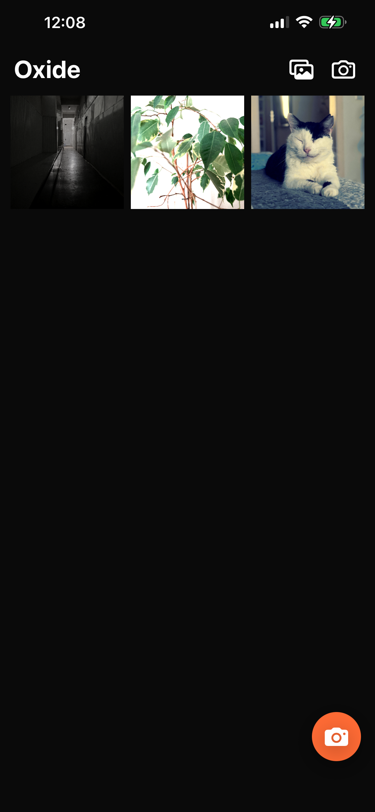
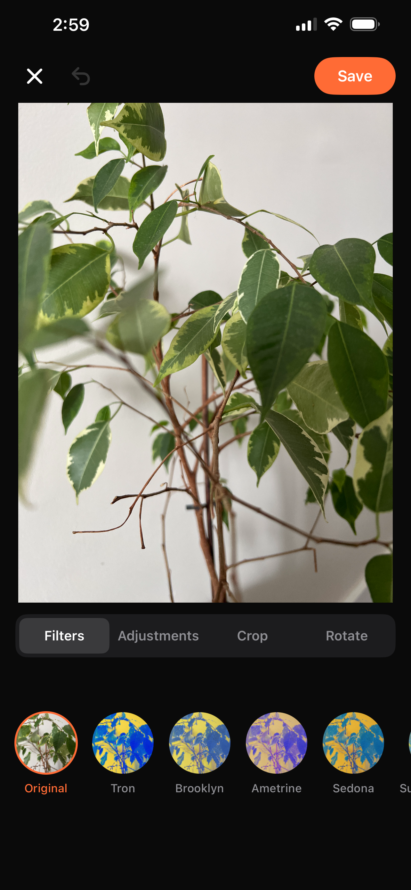
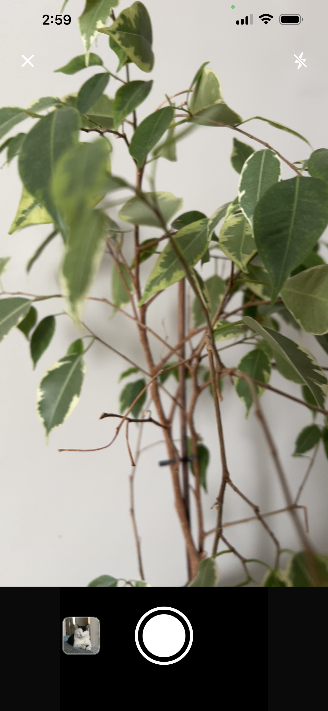

# Oxide

Oxide is a LUT-based photo editor for iOS, built as a production-minded showcase of modern Swift engineering. It combines camera capture, photo-library import, nondestructive editing, GPU-accelerated rendering, and a modular VIPER architecture in a compact open-source project.

> The project is under active development. APIs and persisted edit metadata may evolve.

## Highlights

- Front and rear camera capture with live torch control
- Photo-library import and export
- A reusable LUT engine with adjustable filter intensity
- Nondestructive crop, rotation, exposure, contrast, saturation, brightness, and monochrome edits
- Pinch, pan, double-tap, and button-based editor zoom
- Undo history for editing operations
- Full-resolution export and the native iOS share sheet
- Metal-backed Core Image rendering with cached LUT cube data
- Swift 6 concurrency and Swift Package Manager modularization

## Screenshots

| Gallery | Editor | Camera |
| :---: | :---: | :---: |
|  |  |  |

## Architecture

The app uses VIPER at the feature level and SPM targets for module boundaries:

```text
Oxide (app target)
└── OxideModules
    ├── Root
    ├── Home
    ├── Gallery
    ├── ImageProcessor
    ├── Onboarding
    ├── Settings
    ├── Splash
    ├── AppCore
    └── UIComponents
```

Within `Gallery`, SwiftUI Views render presenter state, the Presenter coordinates user intent, Interactors adapt reusable services to the feature, and the Router owns system presentation. `ImageProcessor` owns camera capture, edit recipes, storage primitives, LUT preparation, and rendering through a shared Metal-backed `CIContext`.

### Reusing ImageProcessor

`ImageProcessor` is independent from Gallery and organized as a portable subsystem:

```text
ImageProcessor/
├── Capture/       Camera session, authorization, preview, and configuration
├── Processing/    Edit recipes, crop/adjustment models, LUTs, rendering, export
└── Store/         Image files, Photos export, and actor-isolated edit history
```

Client applications keep their own photo models and conform them to `ImageProcessingSource`:

```swift
struct ProjectPhoto: ImageProcessingSource, Sendable {
    let imageSourceURL: URL
    let imageEditRecipe: ImageEditRecipe
}

let outputURL = try await ImageExportService()
    .exportJPEG(from: projectPhoto, filename: "edited-photo")
```

Camera capture is configured without Gallery dependencies:

```swift
let camera = CameraSessionController(
    configuration: CameraCaptureConfiguration(position: .back)
)
```

### LUT assets

The image-processing engine and LUT integration are open source, but the
proprietary LUT image assets shown in the screenshots are intentionally not
distributed. A clean clone runs with the Original preset and the rest of the
editor functionality intact. Developers can add LUT resources they own to
`OxideModules/Sources/ImageProcessor/LUTs/`; that directory is excluded from
Git apart from its setup notice.

Project maintainers with access to the private asset repository can install the
official LUT set with:

```sh
./Scripts/install-luts.sh
```

The command clones `mentalparalyse/Oxide-LUTs` using the developer's existing
GitHub credentials and copies its PNG resources into the ignored LUT directory.
It also accepts an existing checkout, which avoids another network fetch:

```sh
./Scripts/install-luts.sh /path/to/Oxide-LUTs
```

### Private effects

The production effect renderer is maintained in the private
`mentalparalyse/Oxide-Effects` repository. A public clone does not contain or
download that implementation. Without it, `ImageProcessor` remains buildable
and effect recipes pass images through unchanged.

Maintainers with repository access can install the private package with:

```sh
./Scripts/install-effects.sh
```

The ignored checkout is placed at `Oxide-Effects/` and Swift Package Manager
links it automatically on the next package resolution. An existing checkout
can be installed without another network fetch:

```sh
./Scripts/install-effects.sh /path/to/Oxide-Effects
```

## Requirements

- Xcode 17 or newer
- Swift 6.1 or newer
- iOS 16 or newer
- A physical iPhone for camera and torch testing

## Getting started

1. Clone the repository.
2. Open `Oxide.xcodeproj` in Xcode.
3. Select the `Oxide` scheme and a signing team.
4. Build and run.

The app already declares camera, photo-library read, and photo-library add usage descriptions in `Oxide/Info.plist`.

## Tests

Run the package tests from Xcode, or from the repository root:

```sh
swift test --package-path OxideModules
```

Camera and Photos authorization flows still require device-level verification because the corresponding Apple frameworks are not fully represented by unit tests.

## Performance notes

- A reusable Metal-backed `CIContext` avoids repeated GPU setup.
- LUT cube data is cached and previews are prepared with bounded concurrency.
- Full-resolution rendering and image encoding run away from the main actor.
- Camera configuration and session operations are serialized on a dedicated queue.
- Thumbnail rendering is pixel-bounded to reduce decode cost and memory pressure.

## Roadmap

- Add UI and snapshot test coverage
- Add filter-pack discovery and StoreKit 2 purchases
- Improve crop gestures with corner handles and locked aspect ratios
- Add export format and quality controls

## Contributing

Issues and focused pull requests are welcome. Please keep business logic out of SwiftUI Views, include tests for behavior changes, and preserve the module boundaries described above.

## License

Oxide is available under the MIT License. See [`LICENSE`](LICENSE).
